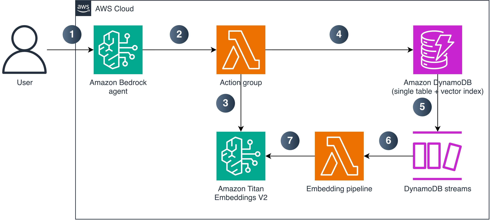

# Build a unified AI agent architecture with DynamoDB and Bedrock

## Overview

This reference implementation deploys a unified AI agent architecture that combines Amazon DynamoDB native vector search with an Amazon Bedrock agent. The solution provisions a DynamoDB table with a vector index for semantic similarity search, an automatic embedding generation pipeline powered by DynamoDB Streams and Amazon Titan Text Embeddings V2, and a Bedrock agent with action groups that enables natural language queries over your stored documents. Write documents to the table and the system handles embedding generation, semantic search, and conversational retrieval without any additional infrastructure.

## Architecture

The solution deploys three AWS CDK stacks in dependency order:

1. **DynamoDBStack** - DynamoDB table with native vector index (foundation layer)
2. **LambdaStack** - Embedding pipeline and action group Lambda functions (depends on DynamoDBStack)
3. **BedrockAgentStack** - Bedrock agent and action group configuration (depends on LambdaStack)



*Figure 1: Unified AI agent architecture using DynamoDB vector search and Amazon Bedrock*

**Data flow:**

1. The user sends a natural language query to the Amazon Bedrock agent.
2. The agent invokes the action group Lambda function to fulfill the request.
3. The action group Lambda calls Amazon Titan Embeddings V2 to generate a query embedding vector.
4. The Lambda performs a `SearchVectors` call against the DynamoDB table's vector index (or `GetItem` for direct retrieval).
5. When new documents are written to DynamoDB, DynamoDB Streams captures the change events.
6. The embedding pipeline Lambda triggers on stream events (INSERT/MODIFY).
7. The embedding pipeline calls Amazon Titan Embeddings V2 to generate a 1,024-dimension vector and writes it back to the item.

## Prerequisites

- An AWS account with permissions to create DynamoDB tables, Lambda functions, Bedrock agents, and IAM roles
- [AWS CDK CLI v2](https://docs.aws.amazon.com/cdk/v2/guide/cli.html) installed
- Python 3.12 or later
- Access to Amazon Titan Text Embeddings V2 (`amazon.titan-embed-text-v2:0`) enabled in Amazon Bedrock
- Access to an Anthropic Claude or Amazon Nova model for the Bedrock agent's foundation model

## Deployment

```bash
git clone <repo-url>
cd sample-dynamodb-vector-search-architecture
python3 -m venv .venv
source .venv/bin/activate
pip install -r requirements.txt
cdk bootstrap   # If first CDK deployment in this account/region
cdk deploy --all
```

The deployment creates all three stacks and outputs the table name, agent ID, and agent alias ID.

## Post-deployment

After deployment, seed the table with sample data and test the agent:

```bash
# Seed 15 sample documents and wait for embeddings to generate
python scripts/seed_data.py --table-name <TABLE_NAME> --region <REGION> --wait

# Test the agent with sample queries
python scripts/test_agent.py --agent-id <AGENT_ID> --agent-alias-id <ALIAS_ID> --region <REGION>
```

Get `TABLE_NAME`, `AGENT_ID`, and `ALIAS_ID` from the CDK stack outputs printed after deployment.

## Customization

All configurable values are defined in `cdk.json` context. Override them with the `-c` flag during deployment:

```bash
cdk deploy --all -c project_prefix=my-project -c environment=staging
```

| Key | Default | Description |
|-----|---------|-------------|
| `project_prefix` | `unified-agent` | Prefix for all resource names |
| `environment` | `dev` | Environment tag value |
| `agent_foundation_model` | `anthropic.claude-3-haiku-20240307-v1:0` | Foundation model for the Bedrock agent |
| `embedding_model_id` | `amazon.titan-embed-text-v2:0` | Model for generating embeddings |
| `embedding_dimensions` | `1024` | Vector dimensions for embeddings |
| `vector_distance_function` | `COSINE` | Distance function for similarity search |
| `vector_index_name` | `content-embedding-index` | Name of the DynamoDB vector index |
| `table_name_suffix` | `unified-agent-data` | Suffix for the DynamoDB table name |

## Cost considerations

This solution is designed for demo and development use. Costs include:

- **Amazon DynamoDB** - On-demand (pay-per-request) pricing with no idle costs. You pay only for reads, writes, and storage consumed. Vector search operations are billed as read request units.
- **Amazon Bedrock** - Per-token charges for foundation model invocations (agent interactions) and per-token charges for embedding generation (Titan Text Embeddings V2).
- **AWS Lambda** - Execution charges based on request count and duration. Both functions use 512 MB memory.
- **DynamoDB Streams** - Read request charges for stream records processed by the embedding pipeline.

For current pricing, refer to the [Amazon DynamoDB pricing](https://aws.amazon.com/dynamodb/pricing/), [Amazon Bedrock pricing](https://aws.amazon.com/bedrock/pricing/), and [AWS Lambda pricing](https://aws.amazon.com/lambda/pricing/) pages.

## Clean up

Remove all deployed resources to stop incurring charges:

```bash
cdk destroy --all
```

This removes all three stacks and their associated resources. The DynamoDB table has a DESTROY removal policy, so it is deleted along with all stored data.

## Security

- **Least-privilege IAM** - Scope `dynamodb:SearchVectors` to the specific index ARN. The embedding Lambda needs only `dynamodb:UpdateItem`, not search permissions.
- **No fine-grained access control for SearchVectors** - DynamoDB condition keys like `dynamodb:LeadingKeys` don't apply to the SearchVectors API. For multi-tenant workloads, use the SearchSchema HASH partition key to scope queries by tenant, or use separate tables for strict isolation.
- **Encryption at rest** - DynamoDB encrypts data including vector embeddings using AWS owned keys, AWS managed keys, or customer managed keys through AWS KMS.
- **Transport encryption** - All SearchVectors traffic uses TLS. The API routes to a dedicated search endpoint that the AWS SDKs handle automatically.
- **Bedrock model access** - Restrict `bedrock:InvokeModel` permissions to the specific embedding and agent foundation model ARNs.

## Limitations

- Maximum 5 vector indexes per DynamoDB table
- Maximum 4,096 dimensions per vector attribute
- `TopK` capped at 100 results per `SearchVectors` call
- A HASH attribute is required in the vector index `SearchSchema`
- On-demand capacity mode is required for tables with vector indexes
- The embedding pipeline Lambda processes batches of up to 10 records with a 30-second batching window

## Related resources

- [Amazon DynamoDB vector search documentation](https://docs.aws.amazon.com/amazondynamodb/latest/developerguide/vector-search.html)
- [Amazon Bedrock agents documentation](https://docs.aws.amazon.com/bedrock/latest/userguide/agents.html)
- [Amazon Titan Text Embeddings V2](https://docs.aws.amazon.com/bedrock/latest/userguide/titan-embedding-models.html)
- [AWS CDK Python reference](https://docs.aws.amazon.com/cdk/api/v2/python/)
